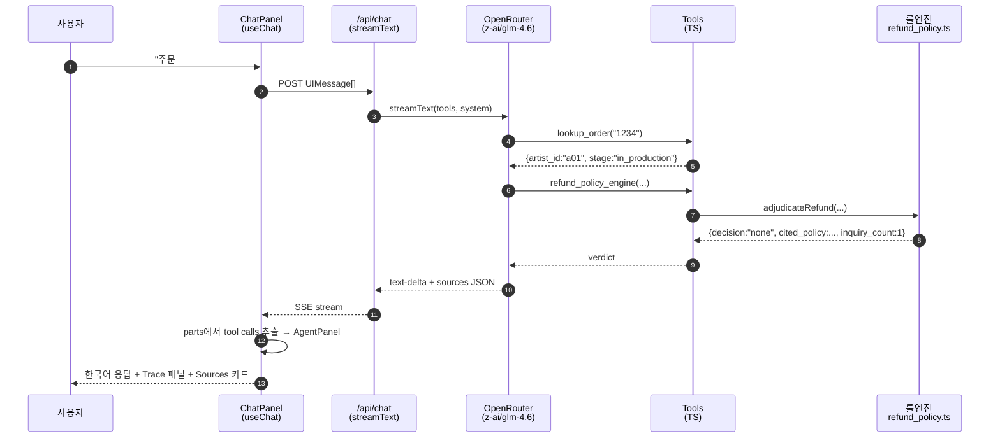

# 아키텍처 메모

> 1-2p · Mermaid 1개 · 비용 4단계 · 한계 3개 · 다음 단계 한 단락.

## 한 줄 요약

**"단일 에이전트 + 룰엔진 + 도구 호출 트레이스"** — LLM은 정책을 해석하지 않습니다. TS 룰엔진(`refund_policy.ts`)이 판정한 결과를 LLM이 한국어로 포장해 응답하고, 응답 끝에 `sources` JSON 코드블록으로 근거를 첨부합니다.

## 도구 선택 이유

| 영역 | 선택 | 이유 |
|---|---|---|
| 베이스 레포 | `openai/openai-cs-agents-demo` (MIT) | Next.js + UI + Agents SDK 기성품. **Phase 2 검증 자산**으로 보존, v0 UI는 새로. |
| 빌드 도구 | Claude Code (Opus 4.7 1M ctx) | 사용자 익숙 + Max 한도 무료. |
| 라이브 모델 | OpenRouter `z-ai/glm-4.6` | 한국어 강함, OpenAI 호환. base_url 한 줄로 모델 교체. |
| Frontend / API | Next.js 15 + Vercel AI SDK 6 | 단일 도메인 배포(인증 함정 0), `useChat` 훅이 SSE 자동 처리. |
| 룰엔진 | TS pure function + Vitest | LLM 의존성 0, 단위 테스트 **18/18** 통과(17 케이스 + sources schema). |
| Trace 패널 | 클라이언트 사이드 | `UIMessage.parts`에서 `tool-*` 추출 → 한글 표시명 매핑(`display.ts`). 백엔드 상태 동기화 불필요. |
| 디자인 | shadcn/ui (button, input, card, scroll-area, badge) | 기성 컴포넌트 조립. |
| 데이터 | 합성 JSON (상품 50 / 작가 10 / 대화 30) | DB 오버킬 회피. 실 운영은 ERP/카탈로그 API로 교체. |
| 배포 | Vercel 단일 프로젝트 | 인증·CORS·도메인 함정 0. |

## 데이터 흐름

## 비용 4단계

호출당 토큰 추정: 시스템 프롬프트 ~600 + 사용자 입력 ~50 + 도구 결과 ~300 + 응답 ~400 = **~1,400 tokens/call**. OpenRouter `z-ai/glm-4.6` 가격 기준 호출당 ~$0.0015.

| 단계 | 호출량 | 추정 월 비용 | 비고 |
|---|---|---|---|
| **PoC (현재)** | 데모/평가 ~수백 회 | **~$1-2** | OpenRouter 무료/소액 충전 |
| **베타 (단일 클라이언트)** | 일 100건 × 30일 = 3,000 | **~$5-15** | `max_tokens` cap + 캐싱 |
| **프로덕션 (단일, 자동 100%)** | 일 1,000건 = 30,000 | **~$50-150** | Redis 카운터 + 모니터링 |
| **스케일 (100 클라이언트)** | 100 × 일 1,000건 | **~$5,000-15,000** | 클라이언트 fine-tune 또는 Sonnet 4.6 교체 |

**모델 교체 비용은 0**: `app/ui/app/api/chat/route.ts`의 `openrouter.chat("z-ai/glm-4.6")` 한 줄. base_url 그대로 OpenRouter가 모든 주요 모델 라우팅.

## 한계 3개

1. **시연용 합성 데이터** — 주문 9건·작가 10명·상품 50개 하드코딩. 실 운영은 ERP/주문 DB · 카탈로그 API 연동 + 작가 정책 메타데이터 마이그레이션 필요.
2. **카운터가 in-process Map** — `lib/tools.ts`의 `inquiryCounters` Map은 Vercel Function 인스턴스 간 공유 X. 같은 사용자가 다른 region에 라우팅되면 카운터 초기화. 운영은 **Upstash Redis** 같은 외부 KV로 교체 (코드 변경 ~10줄).
3. **VLM(시나리오 C) 미구현** — 사진 하자 판정은 v0.5로 유보. 도구 1개(`vlm_judge_defect`) 추가만 하면 즉시 활성. OpenRouter `z-ai/glm-4.6v` 또는 Gemini 2.5 Flash로 base_url 한 줄.

## 다음 단계

환불 안내 종결 후 **자동 추천**으로 CRM 회복 모션 → **멀티모달 출력**(작품 케어 가이드 GIF 즉석 생성) → **모델 교체**(base_url 한 줄로 Sonnet 4.6 또는 클라이언트 fine-tune) → **self-improving 운영 봇**으로 데일리 실패 케이스 자동 룰/프롬프트 보강. 사용자 운영 노하우 #5 *"80% 론칭 + 데일리 실패 리뷰"*를 그대로 자동화.
