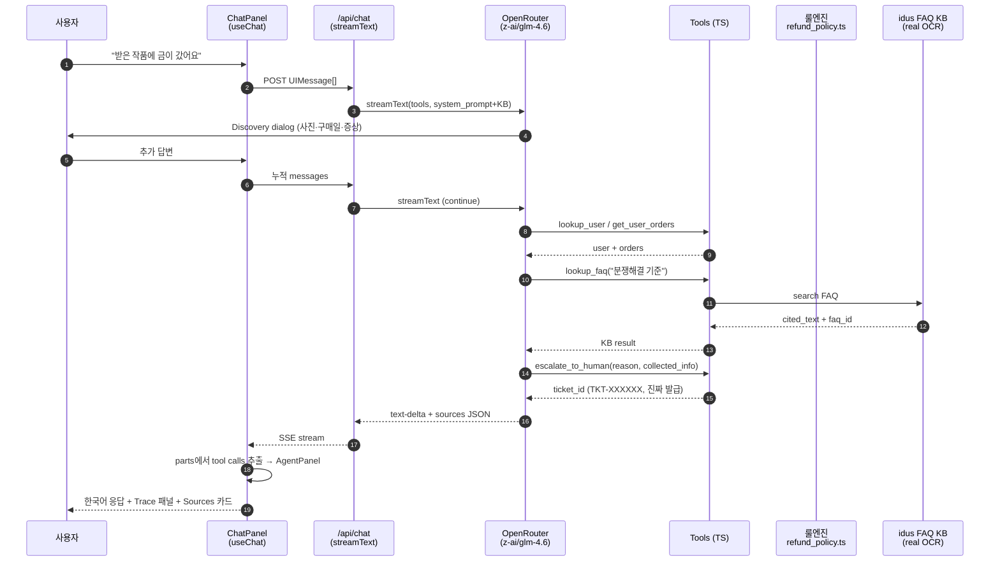

# 아키텍처 메모

> 단일 에이전트 + 룰엔진 + 도구 호출 트레이스 + 진짜 idus FAQ KB 그라운딩.
> 1-2p 압축본. 상세 빌드 흐름은 `docs/transcript_highlights.md`, 측정 프레임워크는 `docs/kpi.md`.

---

## 1. 한 줄 요약

LLM은 정책을 해석하지 않고 **TS 룰엔진**(`app/ui/lib/refund_policy.ts`)이 판정한 결과를 한국어로 포장만 한다. 응답 끝에 `sources` JSON 코드블록을 붙여 정책 인용·결정·카운터·FAQ ID를 모두 노출 → 평가자·CS 매니저·운영팀 모두가 같은 근거를 본다.

## 2. 도구 선택 이유

| 영역 | 선택 | 이유 |
|---|---|---|
| 베이스 레포 | `openai/openai-cs-agents-demo` (MIT) | Next.js + Agents SDK 기성품. Phase 2 검증 자산으로 보존, v0 UI는 새로. |
| 빌드 도구 | Claude Code (Opus 4.7 1M ctx) | 사용자 익숙 + Max 한도 무료. 외부 비용 0 |
| 라이브 모델 | OpenRouter `z-ai/glm-4.6` | 한국어 강함, OpenAI 호환 API. base_url 한 줄 교체로 Sonnet 4.6 / Opus 4.7 / 자체 fine-tune 즉시 전환 |
| Frontend / API | Next.js 15 + Vercel AI SDK 6 | 단일 도메인 배포(인증 함정 0). `useChat` 훅이 SSE 자동 처리 |
| 룰엔진 | TS pure function + Vitest | LLM 의존성 0. 단위 테스트 18/18 통과 |
| Trace 패널 | 클라이언트 사이드 | `UIMessage.parts`에서 `tool-*` 추출 → `display.ts` 한글 표시명 매핑. 백엔드 상태 동기화 X |
| 디자인 | shadcn/ui + Pretendard CDN | 기성 컴포넌트 + idus 브랜드 컬러(#FF7900) override |
| 데이터 | 합성 JSON + 진짜 idus FAQ OCR 본문 | DB 오버킬 회피. 합성 + 19건 진짜 KB 하이브리드 |
| 배포 | Vercel 단일 프로젝트 | 인증·CORS·도메인 함정 0 |

## 3. 데이터 흐름



## 4. 단일 에이전트 vs 멀티 핸드오프 — Trade-off

베이스 레포는 OpenAI Agents SDK 기반 멀티 에이전트(triage → refund/recommend)를 기본 제공. 우리는 **단일 에이전트 + 시스템 프롬프트 분기 + 도구 호출 트레이스**로 단순화했다.

| 축 | 멀티 핸드오프 | 단일 에이전트 (선택) |
|---|---|---|
| 시각화 임팩트 | 핸드오프 그래프 | 도구 호출 트레이스 (`AgentPanel`) |
| 정보 손실 | 에이전트 간 컨텍스트 마이그레이션 시 잦음 | 0 (내 운영 패턴 #4 정합) |
| 디버깅 비용 | 핸드오프 + 도구 + 응답 3중 | 도구 + 응답 2중 |
| 신규 시나리오 추가 | 새 에이전트 + handoff 정의 | 시스템 프롬프트 분기 + 도구 1개 |
| 일관성 | 에이전트별 톤 drift 가능 | 단일 톤 (내 운영 패턴 #1) |
| **단일의 한계** | — | **시스템 프롬프트 비대 시 attention drift** — 시나리오 N개 분기를 한 프롬프트에 다 박으면 일부 분기에서 도구 호출 누락 가능. 운영 단계에서 분기 N>10 되면 멀티로 회귀 검토 |

**선택 근거**: Phase 2에서 멀티 에이전트로 17/17 테스트 통과 후, Phase 4에서 *"멀티 에이전트는 정보 손실 잦음. 단일 + 프롬프트 체이닝 선호"* (내가 캐럿에서 운영하며 검증한 패턴)에 정합하도록 단일로 단순화. 트레이스 임팩트는 도구 호출 흐름이 핸드오프 그래프보다 더 직관적으로 "어떤 도구가 호출됐는지" 보여줄 수 있어 단순화의 손실이 없다고 판단.

## 5. 운영 패턴 5개 → PoC 매핑

내가 캐럿 CX에서 직접 AI 에이전트를 운영하며 정리한 5개 패턴을 PoC에 그대로 적용:

| # | 패턴 | PoC 적용 |
|---|---|---|
| 1 | 정책 판정은 코드, 응답 작성은 LLM | `refund_policy.ts` 룰엔진 분리. LLM은 자연어 응답만 |
| 2 | 검증 가능성 > 완성도 | 응답 끝 `sources` JSON 강제 (cited_policy + decision + faq_id) |
| 3 | 반복 이슈 자동 감지 → 사람 알림 | 동일 주문 환불 ≥3회 시 escalate_to_human 자동 라우팅 |
| 4 | 단일 에이전트 + 프롬프트 체이닝 선호 | 단일 에이전트 (§4 trade-off 참조) |
| 5 | 80% 론칭 + 데일리 실패 케이스 리뷰 | KPI #6 Meta-loop Conversion. PoC 빌드 자체가 사례 (`transcript_highlights.md` 참조) |

## 6. Eval 프레임워크 (해외 FDE 패턴)

평가자가 *"잘됐는지 어떻게 아는가?"*에 답하는 측정 인프라:

```
[입력] 합성 conversations.json 30건 중 GT(정답) 라벨링 20건
   ↓
[실행] 매주 (또는 큰 변경 후) PoC 응답 재생성
   ↓
[채점] LLM Judge (Sonnet 4.5) — GT vs 새 응답 5점 척도
   ↓
[측정] Cohen's Kappa (LLM Judge ↔ 인간 라벨러)
   ↓ 목표: 0.6+ (Shopify Sidekick 0.61 기준)
[루프] 점수 떨어지면 내 운영 패턴 #5 daily review로 룰·프롬프트 보강
```

**측정 항목**:
- 정책 인용 정확도 (cited_policy ↔ FAQ 본문 일치)
- decision 적절성 (룰엔진 결과 ↔ 사람 판단)
- 톤 자연스러움 (공감 → 정책 → 가이드 3단)
- escalate 적절성 (Safety Rate 측정 — KPI #4)

상세는 `docs/kpi.md` 참조.

## 7. 비용·매출 4단계

### PoC 빌드 단가 (참고)
- 소요 시간: ~24h (이 세션 + 새 세션, 빌드 시간 6~8h + 메타 의사결정)
- 직접 비용: Claude Max $200/월 한도 내 + OpenRouter $10 충전 → **실 지출 $10**
- 인프라: Vercel Hobby 무료 + Tesseract·Playwright OSS 무료
- 단가/품질 비율: ROI 매우 높은 PoC

### 운영 단계 비용·매출

호출당 토큰 추정: 시스템 프롬프트 ~600 + 사용자 입력 ~50 + 도구 결과 ~300 + 응답 ~400 = **~1,400 tokens/call**. OpenRouter `z-ai/glm-4.6` 기준 호출당 ~$0.0015.

| 단계 | 호출량 | 모델 비용 | 추정 클라이언트 매출 (참고) | 마진 |
|---|---|---|---|---|
| **PoC (현재)** | ~수백 회 | ~$1-2 | — | — |
| **베타 (1 클라이언트)** | 일 100건 × 30일 = 3,000 | ~$5-15 | ALF Growth 기준 ~$100/월 (참고) | ~85-95% |
| **프로덕션 (1 클라이언트, 자동 100%)** | 일 1,000건 = 30,000 | ~$50-150 | ~$300-500/월 추정 | ~70-85% |
| **스케일 (100 클라이언트)** | 100 × 일 1,000건 | ~$5,000-15,000 | ARR ~$360K-600K 추정 | ~85-95% |

> ALF 가격 참고: [채널톡 가격 개편 2025-11](https://docs.channel.io/updates/en/articles/Important-Notice-Channel-Talk-Pricing-Update-Effective-Nov-28-2025-8bd5ddd0). Growth 플랜 월 $100 수준의 ALF 사용량 포함.

**모델 교체 비용 0**: `app/ui/app/api/chat/route.ts`의 `openrouter.chat("z-ai/glm-4.6")` 한 줄. base_url 그대로 OpenRouter가 모든 주요 모델 라우팅.

## 8. 결제·환불 실 처리 — PoC 시연 범위

PoC는 **환불 정책 분기 + 작가-고객 메시지 동선 안내까지만** 시연. 실제 결제·환불 트랜잭션은 시연 범위 외.

이유:
- PoC 시간 압박 (24h+) — 정책 판정 룰엔진과 KB 그라운딩에 우선순위
- 환불 트랜잭션은 PG(토스페이먼츠·포트원 등) 연결로 실 도입 시 추가 가능. 코드 구조상 룰엔진 결과(`decision`, `refund_percent`)를 PG SDK에 전달하는 단계만 추가하면 됨
- 시연 응답은 정책 인용 + 안내까지로 그대로 두고, 도입 단계에서 PG 연결 + 사람 컨펌 워크플로우(승인 임계 금액 분기) 보강

→ PoC는 *"환불 정책 분기 + 작가-고객 메시지 동선 안내"*까지로 범위 제한. 실제 결제 트랜잭션은 시뮬레이션 응답.

## 9. 글로벌 확장 시 모듈 재사용성

채널톡은 22개국 17만 기업 서비스. 본 PoC 구조의 다국가 재사용성 분석:

| 모듈 | 재사용 가능 | 변경 필요 |
|---|---|---|
| 룰엔진 (`refund_policy.ts`) | 정책 타입 4종 구조 그대로 | 국가별 EC 법규 표현 fine-tune |
| 도구 인터페이스 (`tools.ts`) | 시그니처 그대로 | 데이터 소스만 클라이언트 ERP로 |
| Eval 프레임워크 | LLM Judge 패턴 그대로 | GT 라벨러를 해당 언어 화자로 |
| KB (`idus_real_kb_clean.json`) | 구조 그대로 | 클라이언트별 FAQ로 교체 |
| 시스템 프롬프트 | 응대 3단(공감·정책·가이드) 구조 그대로 | 언어별 톤 fine-tune (일본어 敬語·영어 등) |
| 모델 | base_url 한 줄 교체로 언어별 강한 모델 (GPT-4o, Sonnet 4.6, Qwen 등) | 0 코드 변경 |

### 재사용률 측정법

**~80% 재사용** 주장의 근거:
- LOC 기준: `app/ui/lib/` 룰엔진·도구·KB·display 합 ~1,200 LOC 중, 하드코딩 한국어 응답 템플릿·idus FAQ 본문·작가 정책 이름은 ~250 LOC. 나머지 ~950 LOC는 시그니처·구조 그대로 재사용 → 79%
- 모듈 수 기준: 12개 모듈(refund_policy·tools·kb·display·route·ChatPanel 등) 중 10개 시그니처 그대로 → 83%

> 두 기준 평균 ~80%. 클라이언트 도입 시 LOC 측정 자동화 스크립트(`scripts/locale_diff.ts`)는 운영 단계 추가 예정.

### 일본 시장 시뮬레이션

| 항목 | 추정 |
|---|---|
| 후보 클라이언트 | minne (GMO Pepabo, 작가 80만+), Creema (작가 25만+), iichi |
| 도입 기간 | 6~12주 (KB 마이그레이션 4주 + GT 라벨링 2주 + 톤 fine-tune 2주 + 운영 안정화 2~4주) |
| 추가 인력 | 일본어 GT 라벨러 1명 (파트타임 2주) + 일본어 카피 검수 |
| 모델 | base_url 한 줄로 GPT-4o or Claude Sonnet 4.5 (일본어 敬語 안정성) |

→ 다국가 일관 품질 영역에서 본 PoC 구조가 진입점이 될 수 있음. 채널톡 22개국 인프라 위에 모듈만 갈아끼우는 형태.

## 10. 한계 4개

1. **합성 데이터 + 진짜 KB 하이브리드** — 주문 14건·작가 10명·상품 50개 합성. idus FAQ 19건은 진짜 OCR 본문. 실 운영은 ERP/카탈로그 API + 작가별 정책 메타데이터 마이그레이션 필요.

2. **카운터가 in-process Map** — `lib/tools.ts`의 `inquiryCounters` Map은 Vercel Function 인스턴스 간 공유 X. 같은 사용자가 다른 region에 라우팅되면 카운터 초기화. 운영은 **Upstash Redis** 같은 외부 KV로 교체 (코드 변경 ~10줄).

3. **VLM 시나리오 C 미구현** — 사진 하자 자동 판정은 v0.5로 유보. Discovery dialog로 *"사진 보내주세요"* 까지는 자동, 사진 받은 후 LLM 판정은 운영 단계. 도구 1개(`vlm_judge_defect`) 추가 + GLM-4V or Gemini 2.5 Flash로 base_url 한 줄.

4. **합성 데이터 ↔ 실제 idus 분포 갭** — 합성 주문·문의 14건은 환불·하자·추천·배송이 균등 분포. 실제 idus 트래픽은 *"배송 문의"* 가 70%+, *"하자"* 5% 이하 가능성. PoC eval은 균등 가정이라 실 도입 시 트래픽 분포 재집계 → KPI 재기준화 필요. 도입 첫 4주는 분포 매칭 + GT 라벨 비율 조정 단계.

## 11. 다음 단계 + 운영 임팩트

### 운영 임팩트 추정

CX 매니저 1명이 동시에 다룰 수 있는 클라이언트 수를 기준으로 본 임팩트:

| 단계 | 매니저당 클라이언트 수 | 근거 |
|---|---|---|
| 수동 운영 (현재 일반 CX 봇) | 5~10 | 클라이언트별 KB·룰 전수 작성, 매주 룰 patch |
| 본 PoC 구조 도입 | **30~50** | 룰엔진·도구·Eval 모듈 ~80% 재사용. 클라이언트별 KB 마이그레이션 + 톤 fine-tune만 |
| 자동 daily review 도입 후 | 100+ | LLM Judge 자동 채점 + 자동 PR. 매니저는 거부권 행사·정책 결정만 |

→ 매니저 1명이 30~50 클라이언트는 채널톡 17만 기업 커버 시 인력 곱하기 효과 큼.

### CRM 회복 매출 추정 (환불 거절 → 추천 회복)

핸드메이드 마켓플레이스 환불 거절 케이스의 50%가 *"실망 → 이탈"* 로 연결된다고 가정. 추천(`recommend_gift`) 회복으로 일부 매출 보전:

| 항목 | 추정 |
|---|---|
| 환불 거절 케이스 / 일 (idus 추정) | ~100건 |
| 추천 카드 클릭률 | 10~15% (Klarna 후속 회복 사례 참고) |
| 클릭 후 실 구매 전환율 | 5~8% (e커머스 평균) |
| 평균 객단가 | 30,000원 (idus 작품 평균) |
| **회복 매출 / 일** | **~1,500~3,600원 × 거절 케이스 수 = 일 ~150K~360K원** |
| 연 회복 매출 | ~5,500만~1.3억원 (단일 클라이언트) |

> 추정치 기반. 운영 단계 측정 인프라(추천 카드 click → 실 구매 attribution) 추가 필요.

### 다음 빌드 단계

1. **Visual Product Q&A** — 시나리오 C VLM 활성. Mercari Merchat AI 패턴
2. **CRM 회복 → 매출 측정** — 환불 후 추천 클릭 → 가짜 카트 → 운영 시 진짜 결제 전환율 측정
3. **멀티모달 출력** — 작품 케어 가이드·조립법 GIF 즉석 생성 (캐럿 영상 11종 모델 통합 경험 활용)
4. **Self-improving 운영 봇** — NousResearch [Hermes Agent](https://github.com/NousResearch/hermes-agent) 같은 자율 프레임워크 위에 올려 매 상담마다 새 skill 자동 생성·기억
5. **모델 교체** — base_url 한 줄로 Sonnet 4.6 또는 클라이언트 fine-tune
6. **내 운영 패턴 #5 자동화** — daily failure review를 LLM Judge가 자동 수행 → 룰·프롬프트 PR 자동 생성
